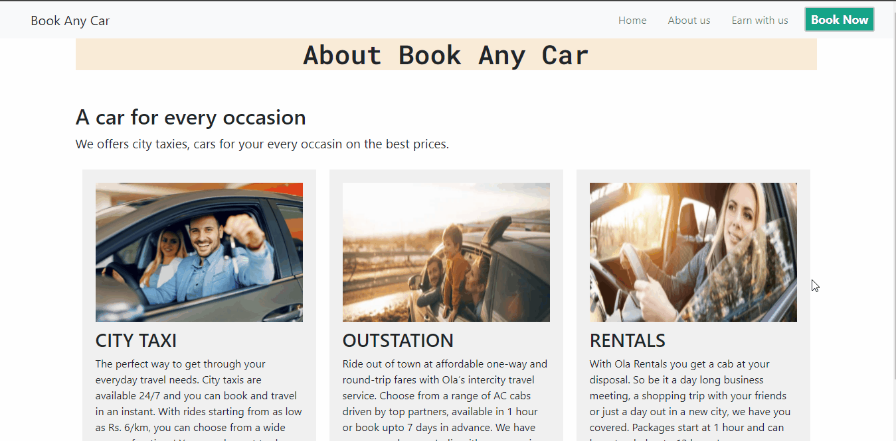
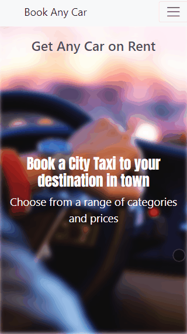
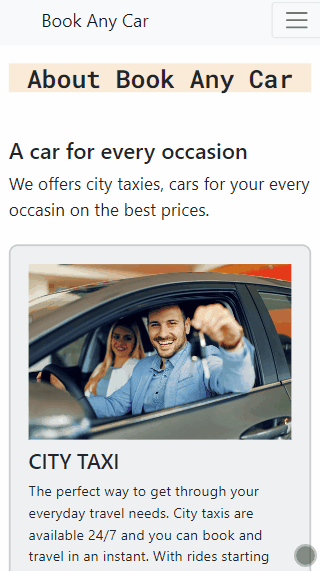
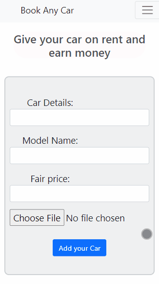
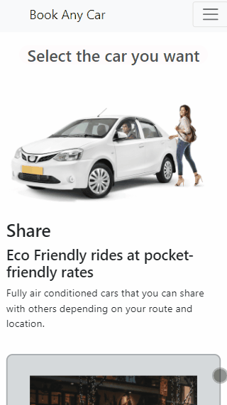
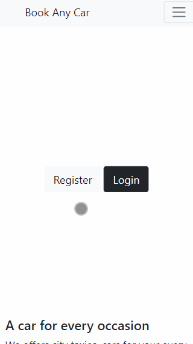
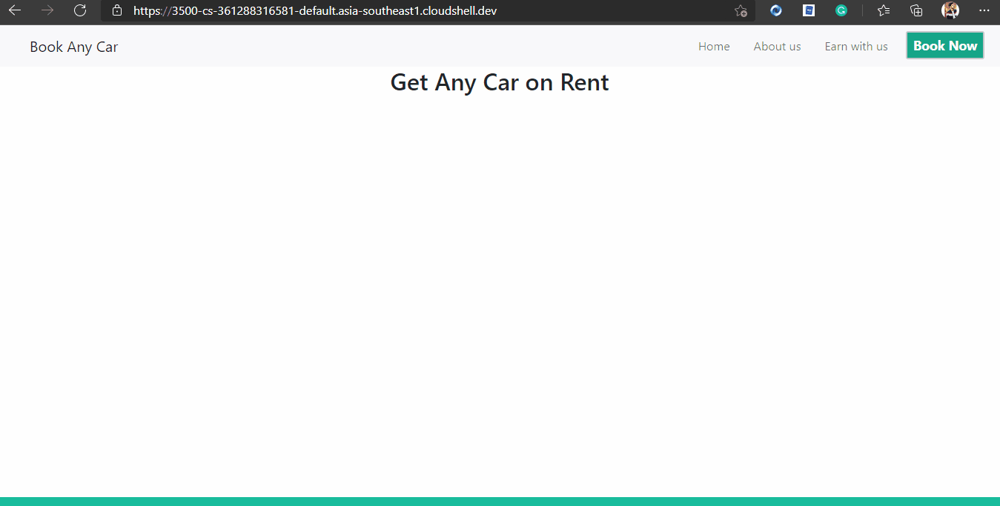

<h1 align=center> Car Rental System Web Application</h1>


<p align=center>A car rental System Project using Node js.</p>

## Description
<p>
You all well known about ola , uber applications which provides car renting services. I used same idea with some of another functionalities. I started working on this project from 24 feb 2021. Building a full stack application always takes a lot of time and effort. The experienced I gained while building this project was amazing, I learned a lot, I experienced how to manage things we don't know about and learn quickly and implement ourselves. 
</p>

## Installation
Use these steps to install and run this application
```Bash
$ git clone https://github.com/tush-tr/car-rental-system
```
```Bash
$ npm install
```
```Bash
$ npm start
```

## Functionalities
### <li>Home Page for introduction

```Link
http://localhost:3500/
```


### <li>Cars list page for select car to book

```Link
http://localhost:3500/cars
```


### <li>Car Add page for adding car for rent

```Link
http://localhost:3500/addcar
```


### <li> User Validation with database encryption


### <li>About Page

```Link
http://localhost:3500/about
```




## All Pages are responsive
<div align=center>



</div>


## Database Configuration
I used my mongodb atlas server for this project. You can use your local server of mongodb or you can use your own atlas server.
```javascript
mongoose.connect("mongodb+srv://<USER-NAME>:<PASSWORD>@cluster0.f729m.mongodb.net/myFirstDatabase?retryWrites=true&w=majority",{useNewUrlParser: true});
```


## Main Technologies and Libraries
<li><a href="https://nodejs.org/">Node js</a>
<li><a href="https://expressjs.com/">Express js</a>
<li><a href="https://ejs.co/">EJS</a>
<li><a href="https://www.mongodb.com/">MongoDB</a>
<li><a href="https://mongoosejs.com/">Mongoose</a>
<li><a href="https://www.w3.org/Style/CSS/Overview.en.html">CSS</a>
<li><a href="https://www.npmjs.com/package/multer">multer</a>
<li><a href="https://www.npmjs.com/package/sharp">sharp</a>
<li><a href="https://www.npmjs.com/package/uuid">uuidv4</a>
<li><a href="https://www.npmjs.com/package/dotenv">dotenv</a>
<li><a href="https://www.npmjs.com/package/mongoose-encryption">mongoose-encryption</a>


## Restful API

<li>Restful APIs with other routes for handling data with Get and Post functionalities.

<br>GET

```Link
http://localhost:3500/api/cars
```

POST
```Link
http://localhost:3500/api/addcar
```

### Posting request to API

```Bash
curl -i -H "Content-Type: application/json" -X POST -d '{"car": "Maruti","model": "2018","fair": "$5000"}' http://localhost:3500/addcar
```

## Preview of  development phases of the application
 ### Preview 1
 <li>Implemented All routes
 <li>Implemented rest apis
 <li>In this phase no database used<br><br>



### Preview 2
<li>Implemented image upload functionality
<li>Implemented database server to the application(MongoDB)
<li>Improved UI<br><br>


### Preview 3
<li>Added content to every page
<li>Added stylesheets for every page
<li>Made every page responsive<br><br>


### Preview 4
<li>Implemented User validation
<li>Implemented database encryption<br><br>


## Author
>Tushar Rajpoot<br>
> <a href="https://tush-tr.github.io/">tush-tr.github.io</a>
